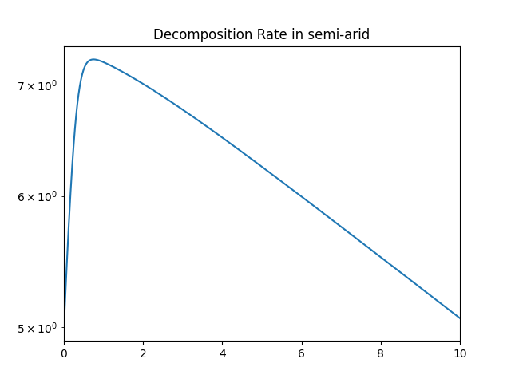
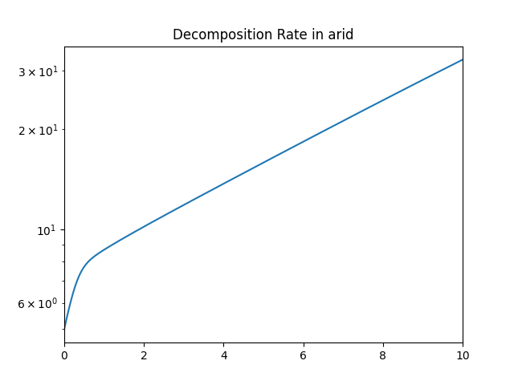

An attempt to estimate the fungal growth patterns in different environment given multiple different fungi with various hyphal extension rates, moisture niches, and moisture tolerances. Specifically looking at how Saprotrophic species perform in these environments. They typically have a higher tolerence to low-moisture environments, but are less compettitive with other fungal species. This project was loosely inspired by [this MCM problem](https://www.mathmodels.org/Problems/2021/MCM-A/2021_MCM_Problem_A.pdf). Note: This was a practice in Mathematical Modeling, and was not meant to reflect real-world data.

Each fungal model was assigned the following variables

  
| Symbol | Description |
|:------:|------------|
| $n$ | Population |
| $r$ | Hyphal extension/growth rate |
| $h$ | Moisture Niche |
| $m$ | Climate Tolerance / Resistance |
| $s$ | Saprotrophic y/n |

We also defined a physical environment as having the variables

| Symbol | Description |
|:------:|------------|
| $k$ | Carrying Capacity (of fungal biomass) |
| $H$ | Moisture Level |

We then define the growth of a single fungal population $n_i$ as 

$$
\frac{dn_i}{dt} = n_i \cdot r_i \cdot \left( 1 - \frac{|h_i - H|}{m_i} \right) \left( \frac{\sum_{j=1}^N n_j}{K} \right)
$$

This is a modified version of a simple Generalized Lotka–Volterra system with an added term for climate compatibility. We simulated a Saprotrophic fungi, a nonsaprotrophic non-compettitive fungi, and a nonsaprotrophic compettitive fungi in two different environments. One environment is a semi-arid climate with limited resources and tolerable conditions, while the other is a much less hospitable climate. Exact values were chosen arbitrarily within reasonable bounds. Fungi parameters were chosen based on real-life patterns and examples, but the exact values are unitless and therefore estimated.

The graphs above show decomposition rate, which correlates linearly with biomass of the Saprotrophic fungi. We can see that the Saprotrophic fungi does much better in arid conditions, becaues it has a higher tolerance to dry environments. In semi-arid conditions, the Saprotrophic fungi was quickly overtaken by the compettitive nonsaprotrophic fungi. This represents how some fungi fall into an ecosystem niche. There is generally a tradeoff between compettitive nature and environmental tolerance, which results in different fungi becoming dominant in different environments.
